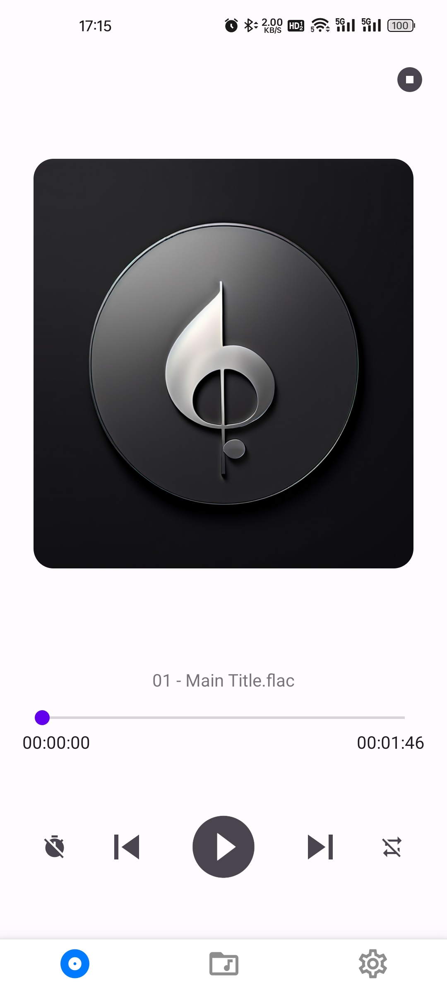
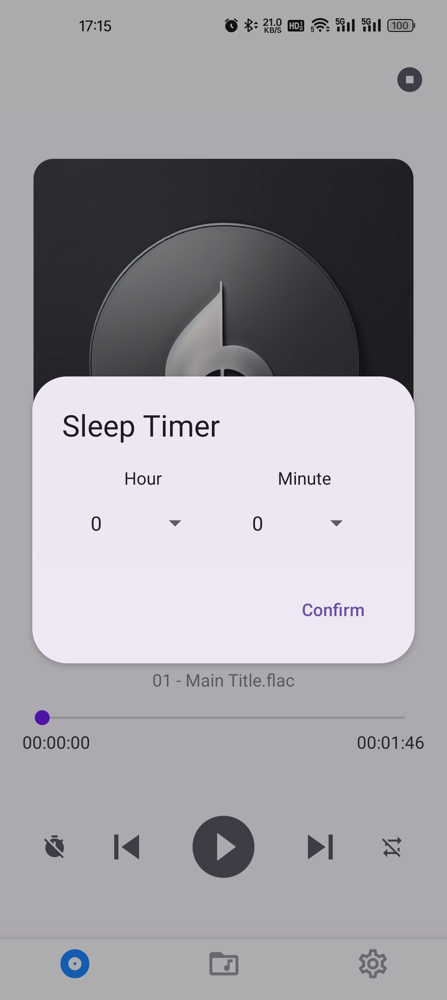
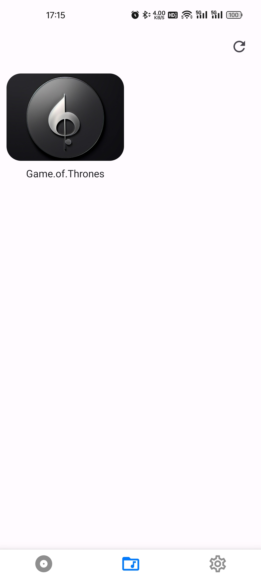
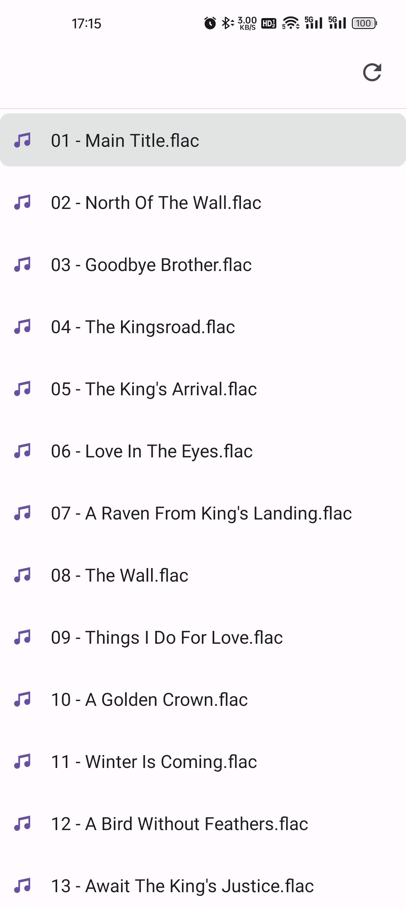
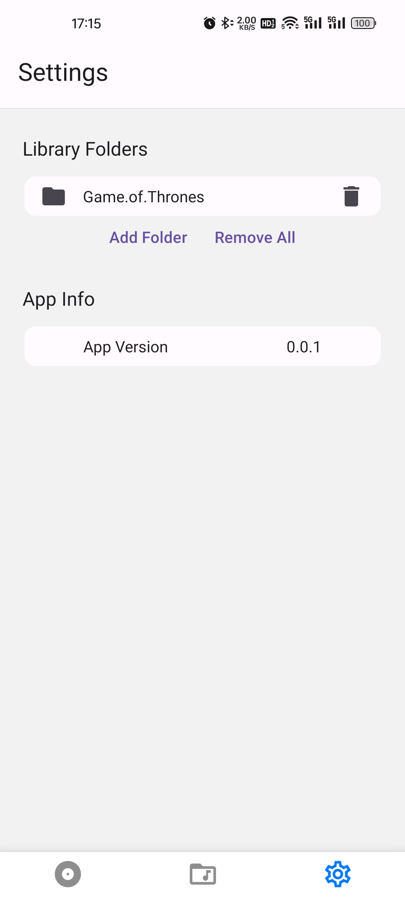

# 🎶 Welcome to My Music Player 👋

## 1. Introduction
- A minimalistic, modern Android music player built with **Expo / React Native**.
- Say goodbye to bloated features — focus purely on enjoying your music.

## 2. Screenshots

  
  
  

 

  
  

## 3. Key Features
- User-defined local music library scanning
- Essential playback controls (play, pause, previous, next, repeat-all, repeat-one)
- Sleep timer

## 4. Roadmap
- Dark theme
- Shuffle playback
- Lyrics display
- Custom album artwork
- WebDAV support
- ...more to come

## 5. Tech Stack
- **React Native**
- **Expo**
- **Zustand** (state management)
- **React Native Track Player** (media playback)
- **React Native Paper** (UI component library)  
